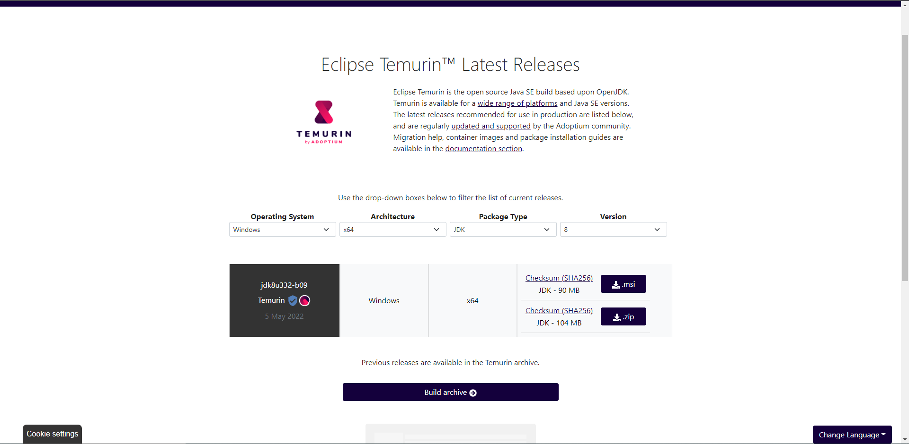

# JAVA **JDK** 下載安裝：

請由以下連結下載安裝檔 `.msi`！如下圖Figure 1所示：**選擇下載版本 8 & 11**

[Eclipse Temurin™ Latest Releases](https://adoptium.net/temurin/releases)



下載完成後執行安裝檔，按照步驟完成安裝！


*注意此步驟需要以 管理員身分 登入後才會繼續執行...


並到以下路徑確認是否已成功安裝完成：

`C:\Program Files\Eclipse Adoptium\jdk-8.0.322.6-hotspo`

`C:\Program Files\Eclipse Adoptium\jdk-11.0.13.8-hotspot`

再打開 CMD 執行以下指令確認 JAVA 版本：

``` shell
java -version
```

Output：

``` shell
openjdk version "1.8.0_322"
OpenJDK Runtime Environment (Temurin)(build 1.8.0_322-b06)
OpenJDK 64-Bit Server VM (Temurin)(build 25.322-b06, mixed mode)
```

表示安裝成功！*(這個表示目前使用的預設 JDK 是版本 8 的)*

[返回](README.md)