# Spring Boot - Getting Start

## 事前準備 - 開發環境建置

### 1 - JDK 下載安裝

[JDK教學說明](JDK.md)

### 2 - IDE 下載安裝 (VS Code / IntelliJ / Eclipse)

[官方 Spring Tools 4](https://spring.io/tools) | 
[Installation Guide](https://github.com/spring-projects/sts4/wiki/Installation)

[VS Code 教學說明](./IDE_VSCODE.md)

~~[Eclipse 教學說明](./README.md)~~

~~[IntelliJ 教學說明](./README.md)~~

## 開始開發 - Spring Boot API 專案

### A - 透過 Spring Initializr 創建 Spring Boot 專案： [Spring Initializr](https://start.spring.io/)

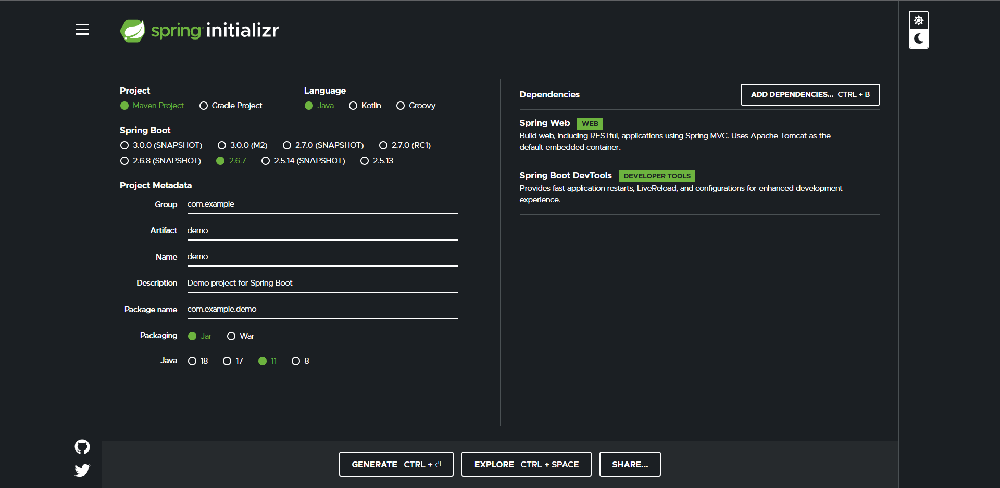

**Project：** Maven Project

**Language：** Java

**Spring Boot：** 2.6.7

**Project Metadata**

 - **Group：** com.rtmart

 - **Artifact：** hellospringboot

 - **Name：** hellospringboot

 - **Description：** Demo project for Spring Boot

 - **Package name：** com.rtmart.hellospringboot

 - **Packaging：** Jar

 - **Java：** 11

**Dependencies：**

 - Spring Web
 - Spring Boot DevTools

選擇完後點選 **GENERATE** 下載 `.zip` 檔，解壓縮到您指定的資料夾！再用 VS Code IDE 開啟此資料夾！

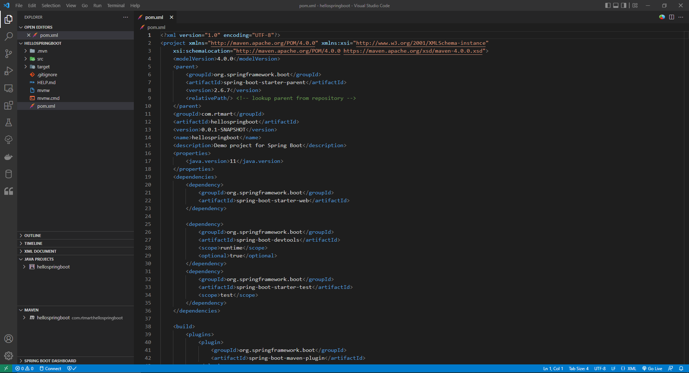

### B - 專案結構說明

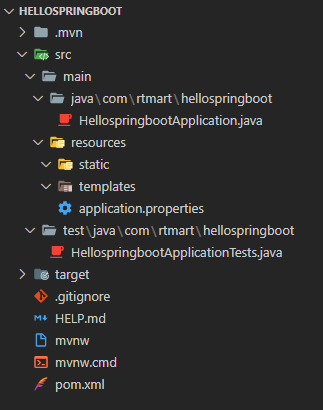

#### Root "/hellospringboot"：根目錄
 - src：源碼所在位置，主要開發區塊！
 - target：源碼編譯/打包過後會產出於此，佈署時的`.jar`檔就是在此取得！
 - pom.xml：軟體套件管理系統設定文件！
 - *.gitignore：若有用Git版控時，可透過此文件設定要忽略的檔案！*

### C - 新增套件(dependency packages)

在VS Code中按 `Ctrl + Shift + p`，選擇 Maven: Add a dependency...，搜尋你要加的套件！

**P.S. 也可到以下連結查詢套件： [MvnRepository](https://mvnrepository.com/)**

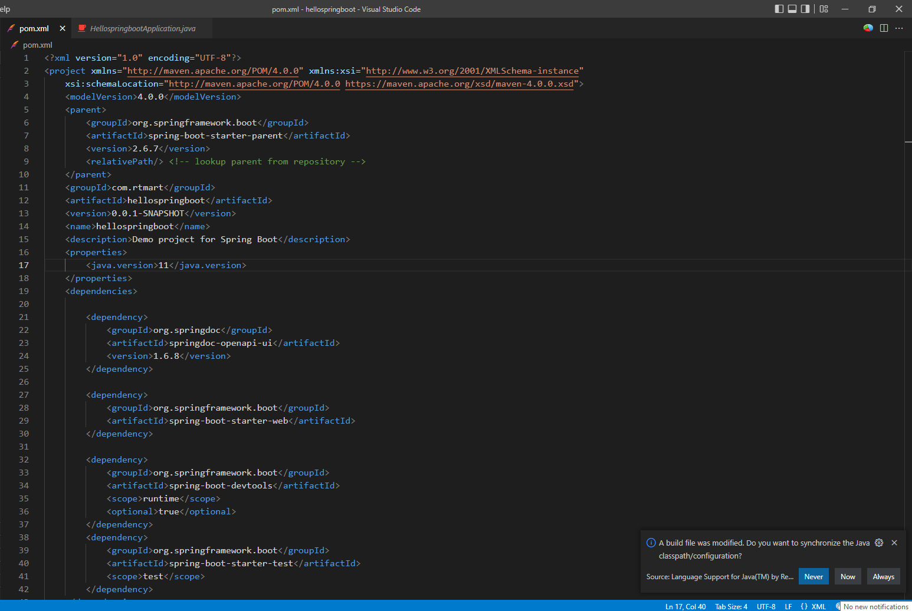

### D - 建立 Model

如圖：

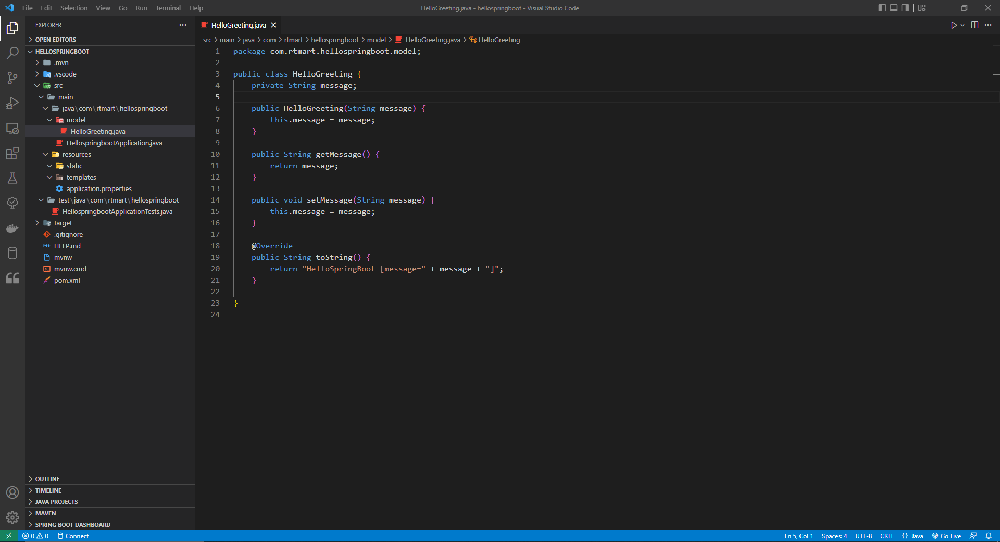

### E - 建立 Controller

如圖：

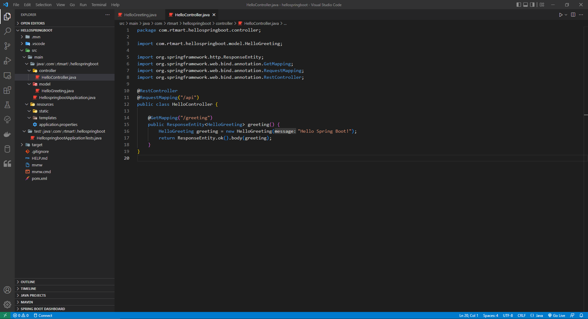

### F - 執行 Run

如圖：

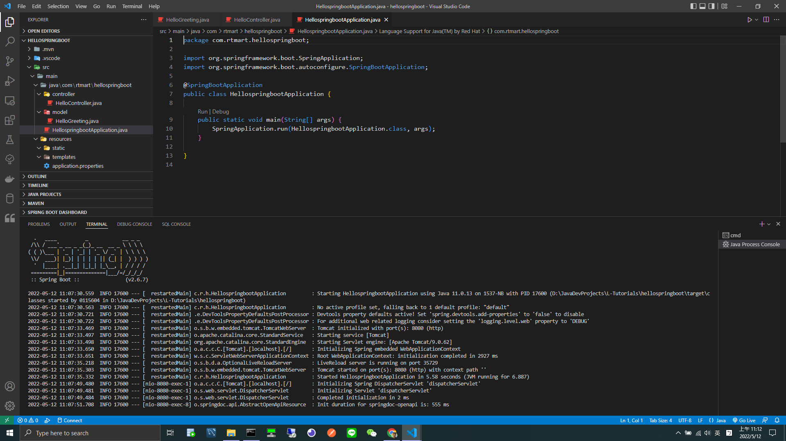

開啟以下連結：[http://localhost:8080/swagger-ui/index.html](http://localhost:8080/swagger-ui/index.html) 你會看到以下畫面：

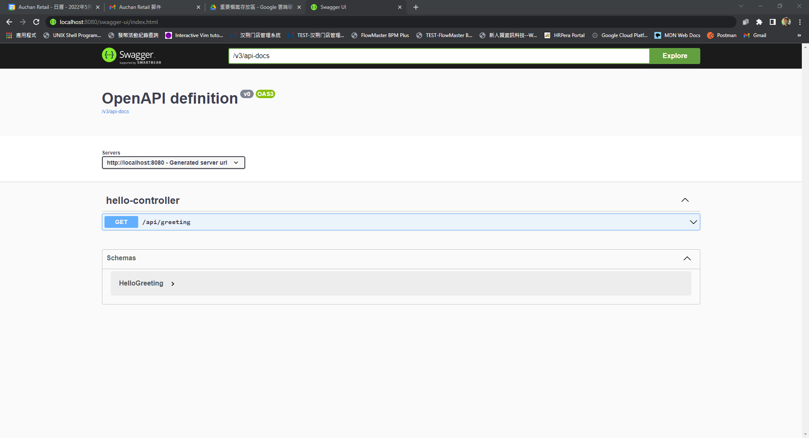

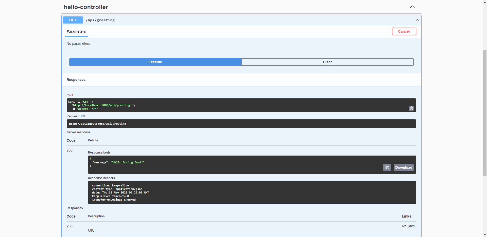

### G - 打包成`.jar`檔

執行 Maven `clean` & `package` 指令，如下圖：

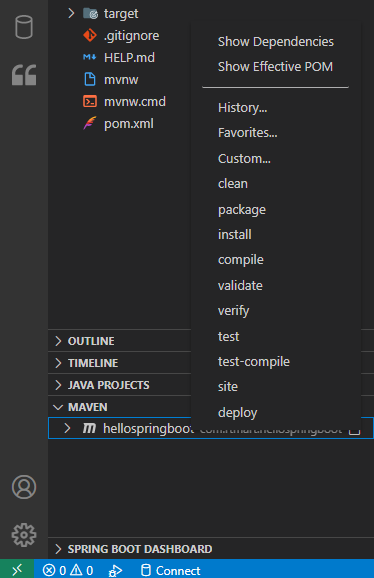

成功打包！！！

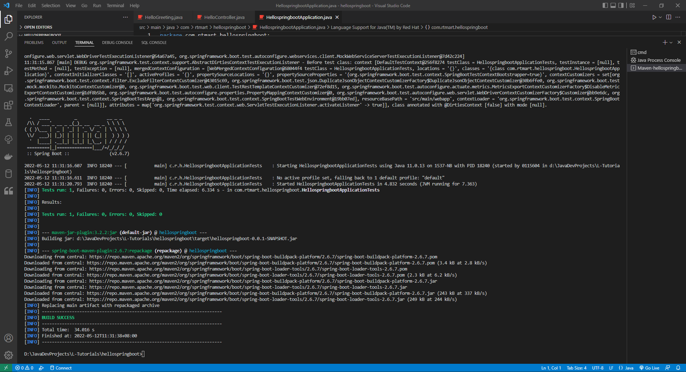

至以下路徑確認產出 `.jar` 檔：`target\hellospringboot-0.0.1-SNAPSHOT.jar`

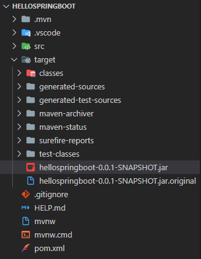

### H - 本機佈署 Local Deploy

打開 Terminal 或 cmd ，移動到此專案根目錄下，輸入以下指令進行佈署 Start Application：

``` shell
java -jar target\hellospringboot-0.0.1-SNAPSHOT.jar
```

Output：

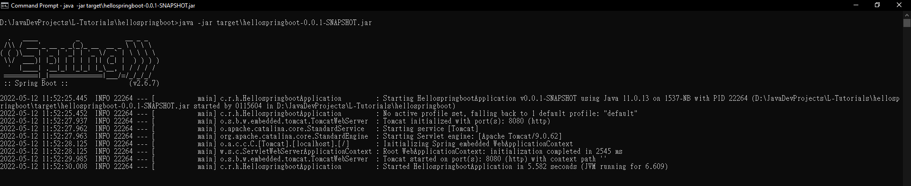
